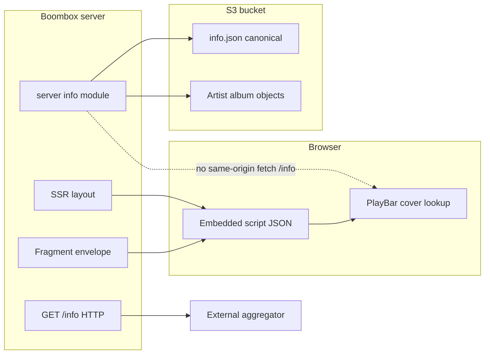

# Library catalog and `GET /info`

This document is the **single source of truth** for how BoomBox stores the
library catalog, exposes it over HTTP, and serves it to first-party UI versus
external aggregators. AI agents and humans should start here when changing
anything related to `/info`, `info.json`, or catalog caching.

## Goals

1. **Durability**: The catalog can survive server replacement when the canonical
   document lives in S3 (bucket root `info.json`).
2. **Operator control**: External **aggregators** can consume `GET /info` when
   the operator allows it. Operators set **`ALLOW_PUBLIC_INFO_JSON=false`** to
   return **401** for unauthenticated HTTP access to `GET /info`, so their music
   is not silently scraped. First-party BoomBox UI does not depend on
   `fetch("/info")` for catalog data.

## Data flow

## `GET /info` (HTTP)

- **Purpose**: Machine-readable library JSON (`contents`, `timestamp`,
  `hostname`, `schemaVersion`) for **external** consumers (e.g. aggregators). It
  is **not** the path first-party browser code should use for cover/metadata
  (see below).
- **`ALLOW_PUBLIC_INFO_JSON`** (environment variable):
  - **Default** if unset: treat as public (`true`).
  - **`false`**: respond with **401** on `GET /info` for requests **without
    valid admin Basic Auth**. Operators (and aggregators they delegate
    credentials to) can still `GET /info` using the same **`ADMIN_USER` /
    `ADMIN_PASS`** pair as uploads.
  - **`true`** or unset: anonymous `GET /info` is allowed (subject to normal
    deployment/TLS).
- **`GET /info?refresh=1`**: **Admin Basic Auth only** (same as upload admin).
  Rebuilds the catalog from storage listing, validates, writes canonical
  `info.json` to S3 (when configured), refreshes server caches, returns fresh
  JSON. Unauthorized requests get **401**.

## First-party browser (no `fetch("/info")` for catalog)

- The **`Files`** tree used for client-side cover lookup (e.g. `coverArtUrl`) is
  embedded in HTML as
  `<script type="application/json" id="boombox-library-contents">` during SSR.
- Fragment navigation responses include **`libraryContents`** in the JSON
  envelope (`lib/fragment-envelope.ts`). `nav-link` applies it so catalog state
  stays in sync without a separate `/info` fetch.
- **`app/util/info-client.ts`** reads and updates that embedded data; it must
  **not** call `fetch("/info")` for library contents. The only intentional
  browser `fetch` to `/info` is **`GET /info?refresh=1`** with credentials in
  the admin refresh control.

## Server internals

- Server code that needs the catalog uses **`server/info.ts`** (and S3 helpers
  in `app/util/s3.server.ts` as appropriate). It must **not** HTTP-loopback to
  `GET /info` on the same host.

## S3 `info.json`

- **Source of truth**: The **catalog document** is
  **`s3://$STORAGE_BUCKET/info.json`** (private object). The server **does not**
  treat the HTTP `GET /info` response as storage—implementation resolves the
  live document in **`server/info.ts`** (on-disk cache + S3 GET/HEAD + listing
  rebuild). What operators back up for catalog durability is **`info.json`** in
  the bucket (plus track objects).
- **Location**: Object key **`info.json`** at the **root** of the configured
  bucket (`STORAGE_BUCKET`). It is the **only** “well-known” catalog asset at
  bucket root; track/album objects use their normal keys.
- **ACL / access**: Object is **private**; the app uses IAM credentials. Never
  rely on public bucket policy for `info.json`.
- **Fallback**: If `info.json` is missing or invalid, rebuild from **list
  objects** (existing catalog build path), **log a warning**, then write a valid
  object back when possible.
- **`hostname`**: The persisted document may omit hostname for portability; the
  HTTP `GET /info` handler **injects** the caller-visible hostname when building
  the response body: **`PUBLIC_HOSTNAME`** if set and parseable (plain host,
  `host:port`, or full URL—`URL` semantics, including IPv6), otherwise the
  request URL’s host. A misconfigured value is ignored (falls back to the
  request host).
- **Caching** (server): Short **on-disk** cache (~5 minutes). After TTL, the
  **next** request may **HEAD/GET** S3 `info.json` to revalidate; there is
  **no** background revalidation task (suited to low-traffic deployments).
- **Conditional GET**: Responses may include **`ETag`**; clients can send
  **`If-None-Match`** to receive **304** with an empty body when the catalog is
  unchanged.
- **HTTP caching**: `GET /info` responses should expose **`ETag`** (aligned with
  S3 where applicable) and **`Cache-Control`** appropriate for public vs private
  catalogs.
- **Cold start**: If the S3 key is missing at startup, **one-time** seed: valid
  local `cache/info.json` if present, else rebuild from listing, then upload to
  S3 (with warnings when inferring from listing).

## Bucket layout note (`artists/` prefix)

Moving all artist prefixes under `artists/` is **optional** and orthogonal to
root `info.json`. Doing so requires a **migration** of keys and URLs, not a
prerequisite for canonical `info.json`.

## Tests and regressions

- **Policy**: No `fetch("/info")` in `app/` except the admin refresh flow
  (`?refresh=1`). Enforced by `app/util/no-internal-info-fetch.policy.test.ts`
  (or equivalent).
- **Integration**: S3 `info.json` read/write/HEAD and fallback paths are covered
  under `tests/server/` with the project’s S3 test import map where applicable.
- After adding tests, run **`deno task coverage:baseline`** and commit
  `coverage-baseline.json` when coverage gates require it.

## Changelog

Major behavior changes to this surface should include an entry in
[`CHANGELOG.md`](../CHANGELOG.md).
